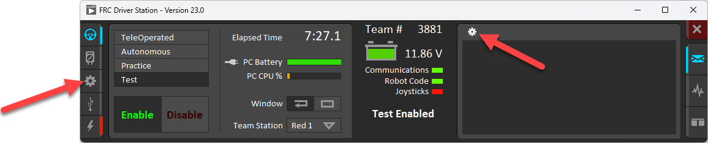
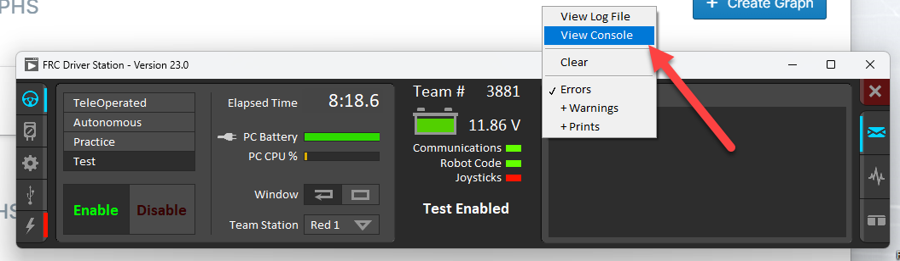
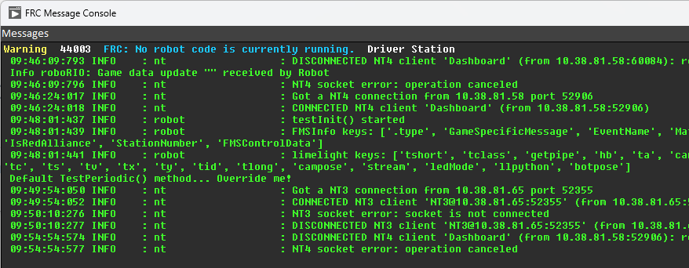

# Preparing for a development session

You need to have a computer set up as in DEVELOPERS_START_HERE.md.  If not, go to that file first.

Open an Anaconda prompt (Start menu, start typing "anaconda" in the search box).

In the Anaconda prompt, change directory (folder) to the folder with your code.  
This is has been set up on the desktop on our computers. 
```cd Desktop\frc2024``` (relative to the user's folder)
or
```cd c:\Users\<username>\Desktop\frc2024``` (specifying the full folder name, but you do need the correct username)


Activate the python environment we set up.  This tells this command window to use the Python version
and libraries that we had installed in the start here document.
```conda activate frc```

In most cases you want to make sure you are using the latest code, which might not have been written using this 
computer.  Hopefully, it was pushed to the GitHub cloud repository.  To get it (pull it from the repository), 
type the following in the command window:

    git pull

# Projects

We will likely have several "projects" running during the season, each being a `robot.py` file with a some associated functionality, such as running the drivetrain or working with the Limelight.  In fact, there are already several of these projects in the `src\helloworld` folder: `accelerometer``, `apriltags``, etc.

Projects have an associated `pyproject.toml` file that details which version of robotpy and which extra components (like Rev Robotics libraries) should be installed on the roboRIO when we deploy code.  We probably want to have all of the projects we are actively developing using the same `pyproject.toml` file so that it isn't loading different robotpy versions to robots when we switch uses.

## Creating a project

Create a folder for the project.  A good place would be as a subfolder of `src`.  Copy the `pyproject.toml` file from the `src\helloworld\hello2024` folder to your folder.  Rod is going to try to keep that project's `pyproject.toml` file up to date.

If this is the first time that this computer has deployed code (or if there has been a robotpy update), in the Anaconda prompt, cd to your new folder and run

    robotpy sync

This downloads Python for the roboRIO, robotpy and other packages from the Internet to your computer in preparation for putting them on the robot.

Create your `robot.py` file, or copy from another project and edit it.  Then proceed to "Deploying code".

(Documented in https://docs.wpilib.org/en/stable/docs/zero-to-robot/step-2/python-setup.html)


## Updating a project's dependencies

If we upgrade to a new version of robotpy, or we need to add a new extra component (like apriltags), we'll need to update the `pyproject.toml` file.

1. In the file, edit the `robotpy_version` to the new version.
2. Uncomment the line with the new extra component.
3. Save the file.
4. Inform people developing different projects and get the new file copied to other projects (pushing to GitHub).
5. Run `robotpy sync` from the Anaconda prompt to download the updated extra components.
6. Other development computers will need to run `robotpy sync` (and potentially also update the WPILib installation as detailed at the bottom of DEVELOPERS_START_HERE.md).

# Editing code
Use VSCode to edit your code.


# Deploying code to the robot

Check the robot:
* If you have changed wiring, are the wire polarities correct?
* Are all the wires connected?
* Make sure there is nothing that could get in the way if motors move.  (wires, wrenches, fingers)

1. Power the robot by turning on the breaker.
2. Open driver station software on the computer.
3. Connect the computer to the Wi-Fi to the access point on the robot (access point name 3881).
4. Check your code again.  Are there any spelling errors?
5. If you are using a different computer from the driver's station to write code, also connect that computer's Wi-Fi to the access point on the robot (access point name 3881).

Deploy your code:

    robotpy deploy

Look for the message that it deployed successfully.

# When you are done developing

When you have the code in a reasonable stopping point, you want to make a "commit", or take a snapshot of the state of the local repository,
and push it to the cloud.  Then you or the next person can pull the latest changes.  

It is a 3-step process:

1. ```git add robot.py```, does what is called "staging" the changed file robot.py for a commit.  If you have changed other files that you want
to commit, also add them the same way.

2. ```git commit -m "Descriptive commit message goes here."```, this makes the commit using the file(s) you staged.  The message should describe what you did, or the status of the code.

3. ```git push origin```, this pushes the latest commit to "origin", which is our GitHub repository.


# Troubleshooting

If you deploy successfully, but you see that the "Robot Code" indicator on the Driver Station software goes back and forth between red and green, you may have
a run-time error in your code. 

1. Open the FRC Driver Station window
1. Click the gear icon on the left-hand side
1. Click the gear icon that appears on the right-hand side



4. In the drop-down menu that appears, choose "View console"



You should see information printed from the robot code here. You should see here some indication of the error. Look for Python error dump traces.  There may be several lines showing errors in library code we are calling, but one of them will
indicate a line number in robot.py.  That's the one to look at.

The below image shows the console view after the robot code was deployed successfully. You can
see information coming from **nt* (the network tables library) and from **robot** (our code).
In this case, the robot code is properly seeing the limelight data in the `limelight` networktabe.



