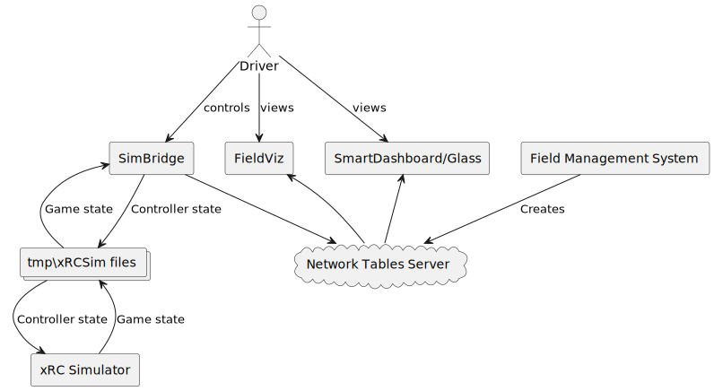
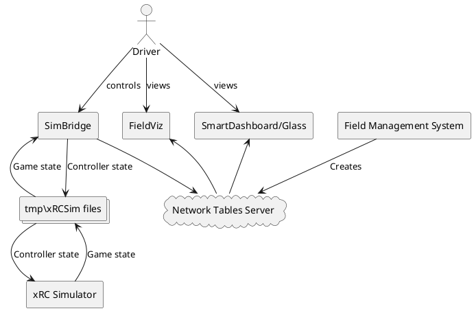

# SimBridge - Use xRC Simulator with your own dashboard

SimBridge is a simple bridge between xRC Simulator and your dashboard 
program(s). While xRC allows for practicing field movement and strategy,
it does not display the robot's state or sensor data.

The driver's station dashboard should be an active aide for the driver, 
giving them real-time feedback on the robot's state. In games with 
shooting/throwing as a primary objective, the robot's position and
alignment with the goal is a critical piece of information.

This bridge allows you to use the xRC Simulator with your own dashboard. 
The bridge reads and writes xRC files to interact with the simulator. It 
also writes to NetworkTables to simulate this information coming from the
robot.

This is a very limited bridge. Currently, it only reads the robot's 
simulated position and puts that in NetworkTables (specifically, in the
`limelight` table, as `botpose`). It also reads a connected gamepad / 
XBoxController and writes that to the simulator. (The simulator disables
keyboard and controller input while in "auto" mode.)

## Usage

1. Connect a gamepad or XBoxController to your computer. If the controller
goes to sleep, it breaks the connection to the bridge. To fix, just restart
the bridge.
2. Open **three** "Anaconda Command Prompt" terminal sessions. In all, run 
`conda activate frc`.
3. In one terminal, navigate to the **src/SimBridge** directory
   1. Run `robotpy sim` to start the simulated Field Management System
4. Navigate to the **src/SimBridge** directory in the 2nd terminal as well. 
   3. Run `python SimBridgeRun.py` to start this program (the bridge).
5. Navigate to the **src/FieldViz** directory in the 3rd terminal.
   4. Run `python FieldVizApp.py` to start the custom dashboard.
6. Run the xRC Simulator. Choose "Single Player".
   1. At the top of the screen, click the "Auto" button. Check the "Enable Automation"
box. Confirm that the "Automation File Dir" has the value `\tmp\xRCSim` (if you change this
you will need to change it in **SimBridgeRun.py** as well).

At this point, you should be able to drive the robot around in the simulator via SimBridge 
and visualize its position using FieldViz and SmartDashboard/Glass.

## Components

The **Field Management System** (`robotpy sim`) creates **Network Tables Server**.

The **Driver** controls **SimBridge**.

**SimBridge** reads from and writes to **tmp\\xRCSim files**.

**xRC Simulator** reads from and writes to **tmp\\xRCSim files**.

**SimBridge** writes to **Network Tables Server**.

**FieldViz** and **SmartDashboard/Glass** read from **Network Tables Server**.

The **Driver** views **FieldViz** and **SmartDashboard/Glass**.

PROFIT!

## Limitations!!!

There are several limitations to using xRC and SimBridge for simulating the real world:

1) The simulated robot is different from ours and cannot be changed. This is an xRC limitation.
2) Robot control is done by emulating controller button/joystick presses. This is a SimBridge
limitation. Because of this, it will be difficult to use this for testing autonomous modes.
3) We pretend that the robot's position is coming from the robot's sensors but are actually
reading it from the xRC simulator. Real Limelight data will undoubtedly be less reliable.
4) The FieldViz app may be misaligned or improperly scaled. 